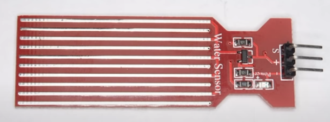
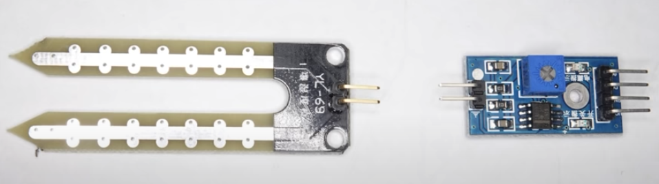
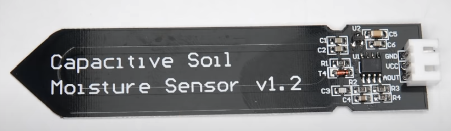
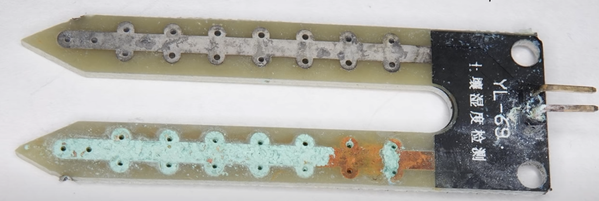
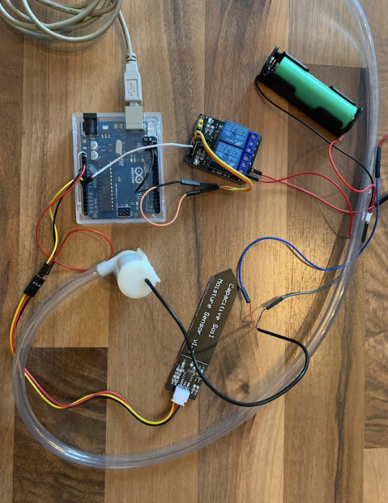
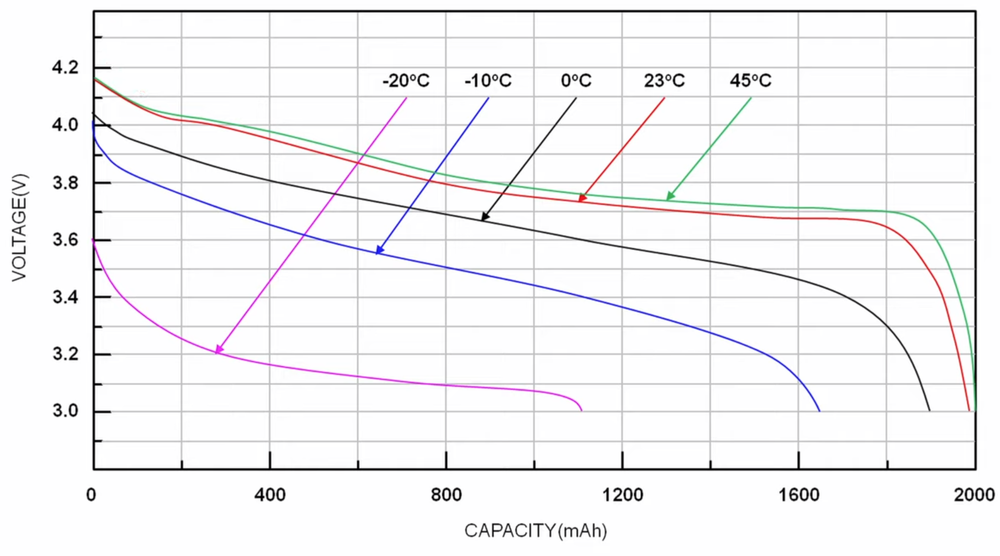

# plants-waterer

  

  

  

### This is my simple Arduino project. You'll find the documentation here:

<strong>
  <a href="rojberr.github.io/plantswaterer/"> rojberr.github.io/plantswaterer/
  </a></strong>

### You don't need to call your neighbour to water your plants while you are on your vacation anymore! 🌱

### This project presents a solution to the problem of rarely-periodic monitoring of the sensor condition for more than a few weeks in home conditions.

## Abstract

The designed robot "Aquary" was equipped with a soil moisture sensor and a small water pump that allows you to irrigate
the pot with the plant when the soil moisture in the pot drops too much. The main design assumption was to make a robot
that would be able to provide the plant with water during a longer absence of the owners - and therefore have a reliable
structure and low power consumption. The prepared documentation presents not only the technical parameters of the
manufactured device, but also the design process and justifies the choices made during the exercise.

## Components

## Design process

Before starting the design of the device, it was decided to make the basic assumptions regarding the planning and design
methodology. Due to the large distance between the two group members and the innovative project (without repetitive
work, consisting in creating a completely newly developed product), the AGILE work methodology and iterative design in
one-week "sprints" were chosen. Such a period of time allowed for careful consideration of subsequent product
improvements, the purchase of appropriate parts, and their assembly and testing.
All the work was done within 4 sprints, resulting in a total of one month of work. The resulting robot could be improved
in subsequent interactions, which the team decided to continue in the future.
The next requirements that the product should meet at the end of the sprint were agreed during the design process and
finally took the following form:

- Week One: (Purpose: Watering Mechanism Working)
- Week Two: (Purpose: Port on Arduino Mini and battery powered)
- Week three: (Purpose: Setting the humidity limit with the button)
- Week four: (Purpose: To use sleep mode on the Arduino and add a wake-up clock)
  Subsequent iterations could include:
- adding a suitable device housing with a "suspended" water container,
- adding a WiFi module that allows you to view and remotely control soil moisture.

Each iteration was preceded by a detailed list of available solutions and the selection of the most optimal one. The
same was done when selecting items. The course of work was decided to illustrate, for example, the selection of a
humidity sensor.
Various types of sensors are available on the market, due to the scale (potted plants) of the system being built, it was
decided to buy a sensor available in the online store in the price range of a few dollars. Before making the purchase,
however, attention was paid to the method of operation of the sensors. The following were considered as possible
options:

- two-legged sensor with PCB controller,

## Problem

## Solution

## Code

## Author

rojberr@outlook.com

TODO:

- How much humidity is normal for house plants?

- Make market sizing top down / bottom up

- do a feature table x - competition y - features to compare

- find direct / indirect / potential / substitute competition

- build a case
    - program display
    - program button
    - case
    - clock - check only 2 times per day