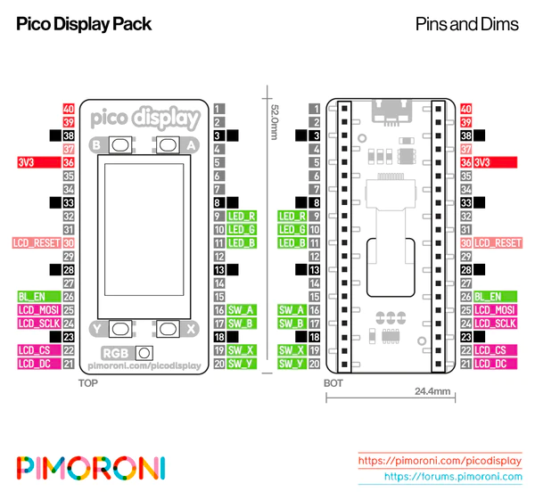
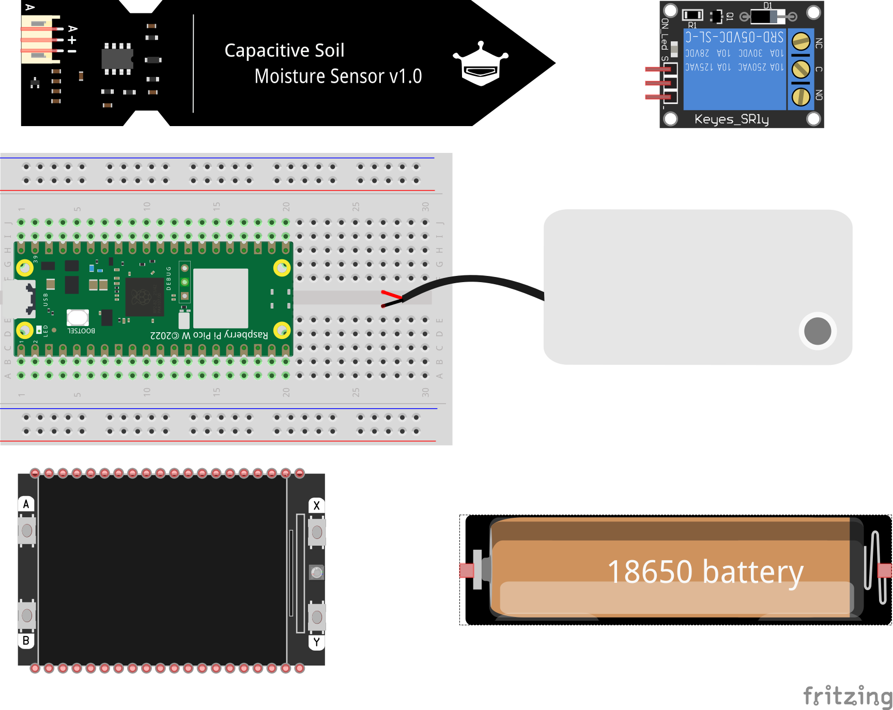
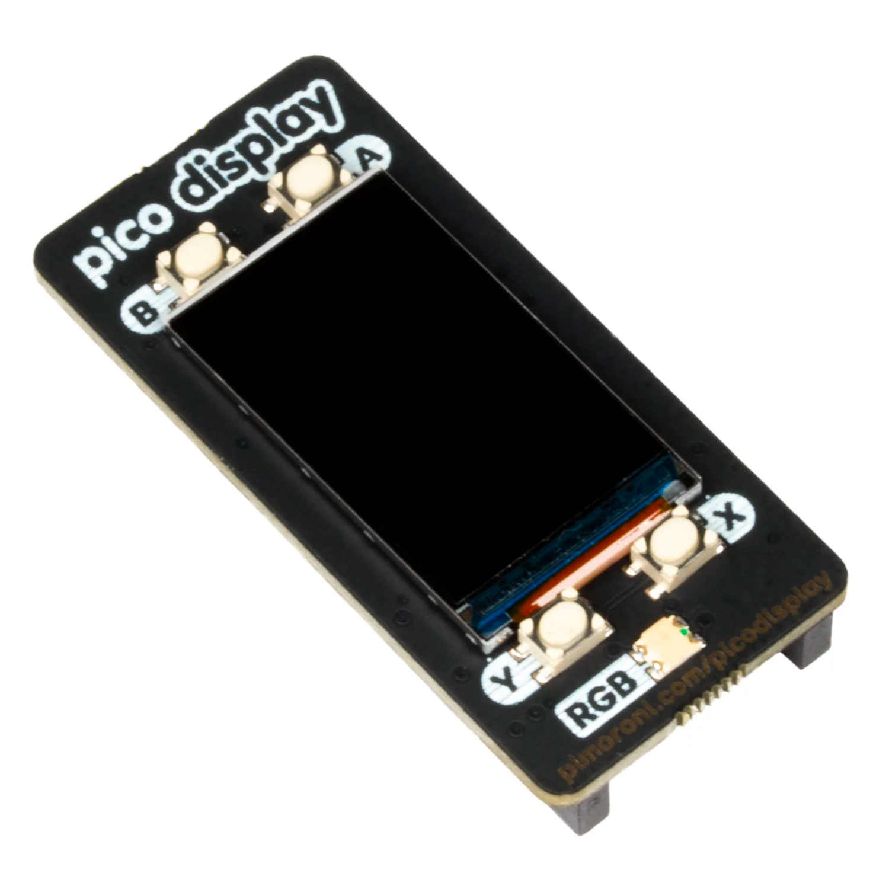

# Parts & Assembly

## Bill of materials

### Raspberry Pi Pico W, RP2040 + WLAN

Introduced by RAspberry Pi in January 2021, is the first Microcontroller in RAspberry Pi Family, powered by RP2040 MCU,
with multiple PWM-capable I/O ports, I2C, SPI, ADC.

- foto

Raspberry Pi Pico is a flexible, low cost microcontroller development board from the folks at Raspberry Pi, based on
their very own chip - the RP2040. It's easily programmable over USB with C/C++ or MicroPython, and ideal for using in
all sorts of physical computing projects, devices and inventions - we're so excited to see what you make with it!

We've called our Pico-sized add-ons packs, as they're designed to attach to the back of your Pico as if it were wearing
a very stylish back pack (or a miniature jet pack, if you prefer). We've also got Pico bases (larger add-on boards with
a space to mount your Pico on top) and some other boards that let you do interesting hackerly things like using multiple
packs at once - click here to view them all!


https://www.raspberrypi.com/documentation/microcontrollers/?version=E0C9125B0D9B

### Pimoroni PIM543 Display

Pico Display lets you turn a Pico into a compact user interface device for a bigger project, capable of giving
instructions, displaying readouts and even incorporating elaborate nested menus. If you'd rather use your Pico as a
standalone device you could make a little rotating slideshow of images, display beautiful graphs from sensor data or
build your own Tamagotchi or matchbox sized text adventure game.

Pico Display Pack communicates with the LCD display via SPI on pins LCD_CS, LCD_DC, LCD_SCLK, and LCD_MOSI. We also PWM
the BL_EN pin (with gamma correction) for full, linear, backlight control. LCD_RESET is tied to the RUN pin on Pico so
the LCD will be fully reset whenever Pico is.

The four switches are wired up as SW_A, SW_B, SW_X, and SW_Y.

There is also an onboard RGB LED (ideal to use an activity indicator!) which is also PWMed (with gamma correction) on
pins LED_R, LED_G, and LED_B. If you want to use the LED pins for something else there are three cuttable traces on the
underside of the board.

Power is supplied through 3V3 meaning that you can use Pico Display Pack both on USB power and from external supplies (
from 1.8V to 5.5V) making it ideal for battery powered projects.



1.14” 240x135 pixel IPS LCD screen
4 x tactile buttons
RGB LED
Pre-soldered female headers for attaching to Pico
Compatible with Raspberry Pi Pico/Pico W.
Fully assembled
No soldering required (as long as your Pico has header pins attached).
Dimensions: approx 53mm x 25mm x 9mm (L x W x H) (dimensional drawing)
Screen usable area: approx 25mm x 15mm (L x W)
Schematic
C/C++ and MicroPython libraries

[pico_display_pack_full_schematic.pdf](assets%2Fpico_display_pack_schematic.pdf)

### Capacitive Soil Moisture Sensor v1.2

- foto

### 5V 1 Channel Relay Module

- foto

### 18650 Battery & Battery Holder

- foto

### Water Pump

- foto

## Assembly

### Schematic




### Code

```python
test
```


coord system
